# TKGs on vSphere 8 with NSXALB

- [TKGs on vSphere 8 with NSXalb](#tkgs-on-vsphere-8-with-nsxalb)
  - [Relocate Images](#relocate-images)
  - [TKGs](#tkgs)
    - [Prerequisites](#prerequisites)
    - [Deployment](#deployment)
    - [Create a Local TKR Content Library](#create-a-local-tkr-content-library)
    - [Replace the Supervisor API Endpoint Certificate (Optional)](#replace-the-supervisor-api-endpoint-certificate-optional)
    - [Register the Supervisor cluster in TMC](#register-the-supervisor-cluster-in-tmc)
    - [Connecting to vSphere with Tanzu Clusters](#connecting-to-vsphere-with-tanzu-clusters)
      - [Deploy autoscaler package](#deploy-autoscaler-package)
      - [Deploy Cert-Manager on Shared Services Cluster](#deploy-cert-manager-on-shared-services-cluster)
      - [Deploy Contour on Shared Services Cluster](#deploy-contour-on-shared-services-cluster)


### Relocate Images
Download Kubernetes OVA Templates
1. For each Tanzu Kubernetes Grid version, download all associated files and store them in a separate folder:
```
●	v1.29.4 - https://wp-content.vmware.com/v2/latest/ob-24042459-ubuntu-2204-amd64-vmi-k8s-v1.29.4---vmware.3-fips.1-tkg.1/
●	v1.30.1 - https://wp-content.vmware.com/v2/latest/ob-24076161-ubuntu-2204-amd64-vmi-k8s-v1.30.1---vmware.1-fips-tkg.5/
●	v1.31.1 - https://wp-content.vmware.com/v2/latest/ob-24300498-ubuntu-2204-amd64-v1.31.1---vmware.2-fips-vkr.2/
●	v1.30.8 - https://wp-content.vmware.com/v2/latest/ob-24481438-ubuntu-2204-amd64-v1.30.8---vmware.1-fips-vkr.1/
●	v1.31.4 - https://wp-content.vmware.com/v2/latest/ob-24536966-ubuntu-2204-amd64-v1.31.4---vmware.1-fips-vkr.3/
●	v1.32.0 - https://wp-content.vmware.com/v2/latest/ob-24537997-ubuntu-2204-amd64-v1.32.0---vmware.6-fips-vkr.2/
```
2. Create a new Content Library named "Kubernetes Service Content Library" 
3. Import each Kubernetes version to the content library. The name of each item must exactly match the name specified in the JSON file.

([Reference](https://techdocs.broadcom.com/us/en/vmware-cis/vsphere/vsphere-supervisor/8-0/using-tkg-service-with-vsphere-supervisor/administering-kubernetes-releases-for-tkg-service-clusters/create-a-local-content-library-for-air-gapped-cluster-provisioning.html))


## TKGs

### Prerequisites

- Obtain a vSphere with Tanzu license
- Enable vSphere HA on the cluster
- Enable vSphere DRS in fully automated mode
- Deploy the TKG admin VM
- Install and configure an NSX-ALB (AVI) cluster
- Install and configure Harbor or another container image registry with TLS certificate
- Create a storage policy for the TKG datastores using [these instructions](https://techdocs.broadcom.com/us/en/vmware-cis/vsphere/vsphere-supervisor/8-0/installing-and-configuring-vsphere-supervisor/create-storage-policies-for-vsphere-iaas-control-plane.html)


### Deployment

From the home menu, select `Workload Management`.

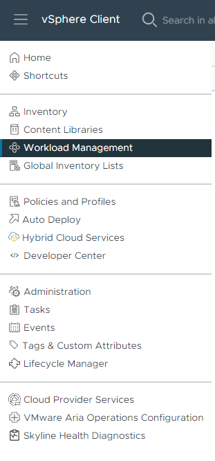

On the `Workload Management` screen, click `Get Started`.

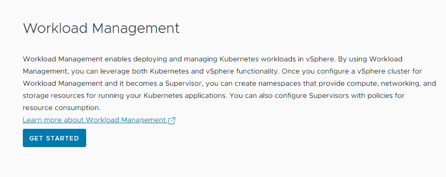

On the `vCenter Server and Network` page, select the vCenter Server system that is setup for Supervisor deployment and select `vSphere Distributed Switch (VDS)` as the networking stack.

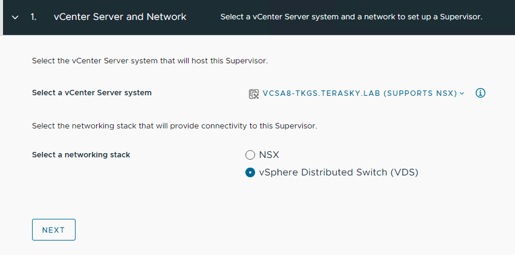

On the `Supervisor location` page, select `Cluster Deployment`.

- Enter a name for the new Supervisor.
- Select a compatible vSphere Cluster.

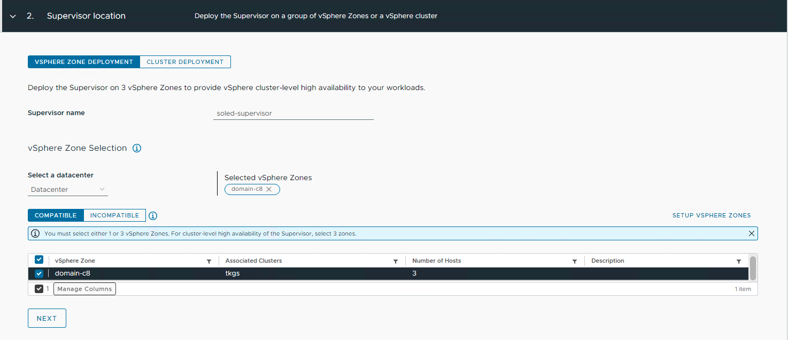

Select storage policies for the Supervisor.

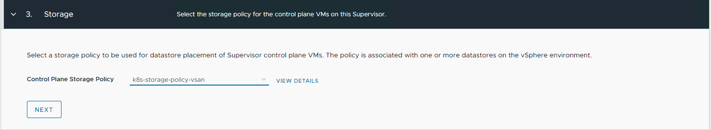

In the `Load Balancer` pane, configure the nsxalb.

- **Name**: Enter a name for the NSX Advanced Load Balancer.
- **NSX Advanced Load Balancer Controller Endpoint**: The IP address or FQDN of the NSX Advanced Load Balancer Controller. The default port is `443`.
- **User name**: The user name that is configured with the NSX Advanced Load Balancer. You use this user name to access the Controller (admin).
- **Password**: The password for the user name.
- **Server Certificate**: The certificate used by the Controller. From NSX-ALB ui, select `Template` -> `Security` -> `SSL/TLS Certificates`

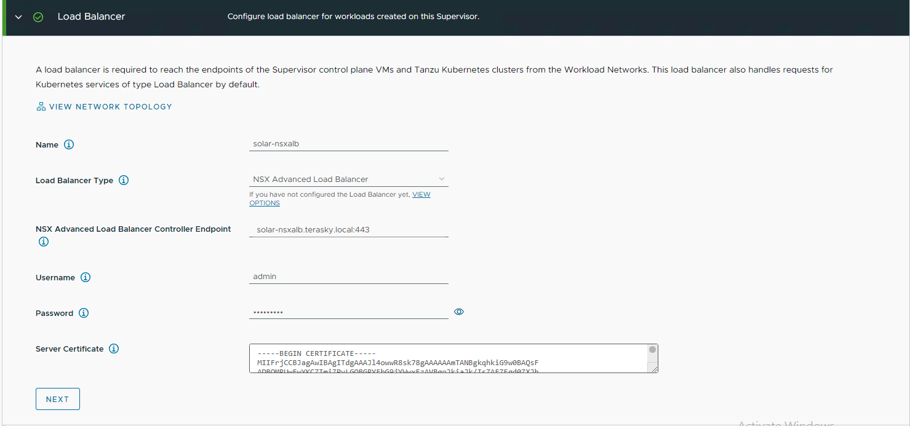

On the `Management Network` screen, configure the parameters for the network that will be used for Kubernetes control plane VMs.

Select the static `Network Mode` and manually enter all networking settings for the management network.

- **Network**: The network where the Supervisor control plane VMs are deployed. vCenter Server must be routable from this network.
- **Staring IP Address**: The first IP in a range of 5 consecutive IPs that will be assigned to the management interfaces of the Supervisor control plane VMs. One IP is assigned to each of the three control plane VMs, one IP is used as a floating IP, and one IP is reserved for use during upgrade.

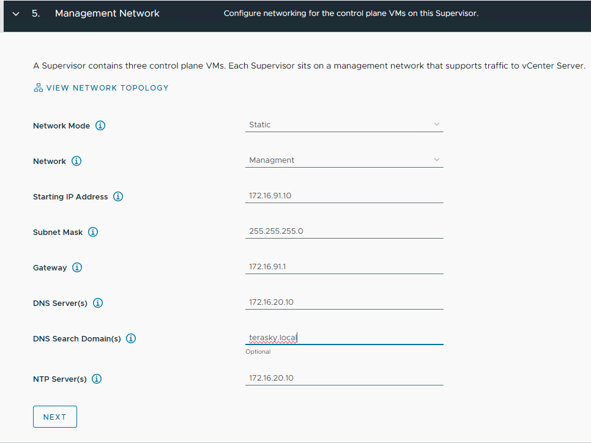

In the `Workload Network` page, enter the settings for the network that will handle the networking traffic for Kubernetes workloads running on the Supervisor.


- **Internal Network for Kubernetes Services**: Enter a CIDR notation that determines the range of IP addresses for Tanzu Kubernetes clusters and services that run inside the clusters.
- **Port Group**: Select the port group that will serve as the Primary Workload Network to the Supervisor. The primary network handles the traffic for the Kubernetes control plane VMs and Kubernetes workload traffic. Depending on your networking topology, you can later assign a different port group to serve as the network to each namespace. This way, you can provide layer 2 isolation between the namespaces in the Supervisor. Namespaces that do not have a different port group assigned as their network use the primary network. Tanzu Kubernetes clusters use only the network that is assigned to the namespace where they are deployed or they use the primary network if there is no explicit network assigned to that namespace
- **Network Name**: Enter the network name.
- **IP Address Ranges**: Enter an IP range for allocating IP address of Kubernetes control plane VMs and workloads. This address range connects the Supervisor nodes and, in the case of a single Workload Network, also connects the Tanzu Kubernetes cluster nodes. This IP range must not overlap with the load balancer VIP range when using the `Default` configuration for HAProxy.
- **Subnet Mask**: Enter the subnet mask IP address.
- **Gateway**: Enter the gateway for the primary network.
- **NTP Servers**: Enter the address of the NTP server that you use with your environment if any.
- **DNS Servers**: Enter the IP addresses of the DNS servers that you use with your environment, if any.

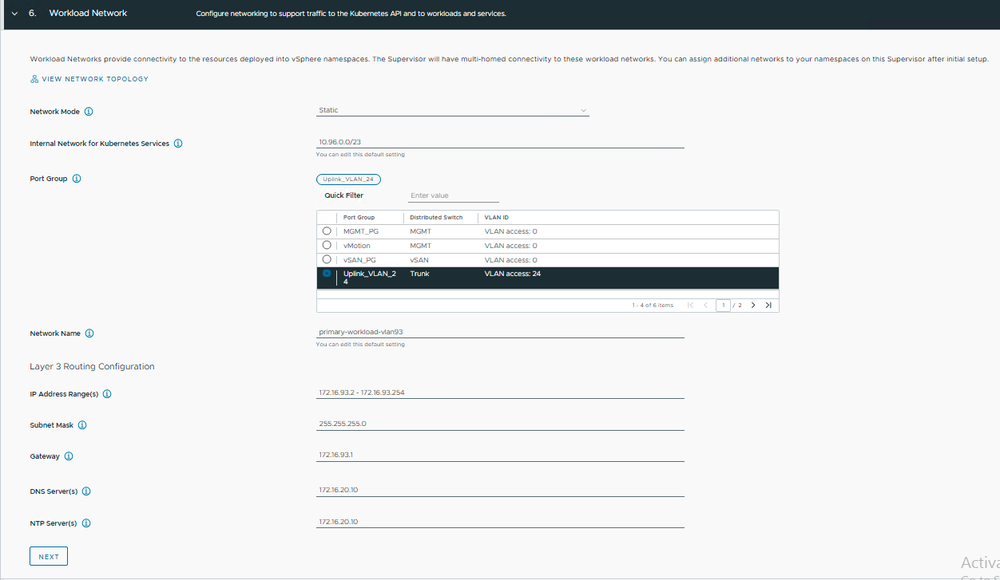

In the `Review and Confirm` page, scroll up and review all the settings that you configured so far and set advanced settings for the Supervisor deployment.

- **Supervisor Control Plane Size**: The amount of resources that you allocate to the Supervisor control plane VMs determines the amount of Kubernetes workloads the cluster can support. The control plane size selected is SMALL by default.
- **API Server DNS Name(s)**: Comma-separated DNS names used to access the API Server. The names will be used as the 'SubjectAltName.DNS' field of the API Server certificate. The Load Balancer IP address is automatically added to the IP field and should not be included here.

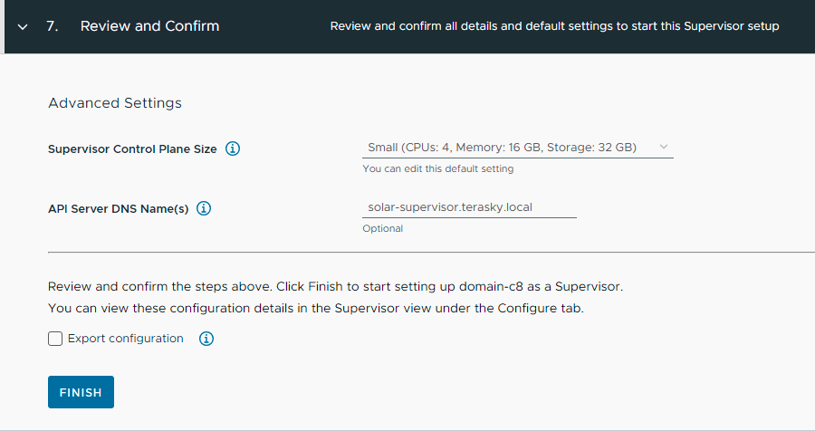

In the `Supervisors` tab, track the deployment process of the Supervisor.

- In the `Config Status` column, click `view` next to the status of the Supervisor.
- View the configuration status for each object and track for any potential issues to troubleshoot.

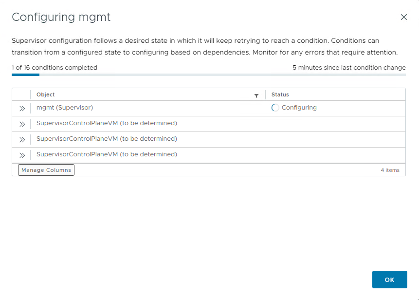

Verify readiness of the Supervisor cluster

In the `Supervisors` tab, click on the name of the `Supervisor`

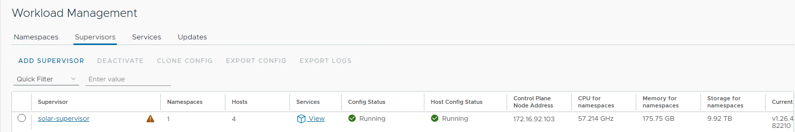

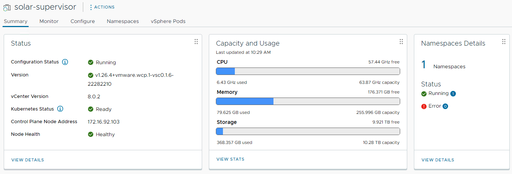


### Replace the Supervisor API Endpoint Certificate (Optional)

In the vSphere Client, navigate to `Workload Management`.

Select `Supervisors` and the select the Supervisor from the list.

Click `Configure` and select `Certificates`.

In the `Workload Management Platform` pane, select `Actions > Generate CSR`.

Replacing Supervisor default certificate


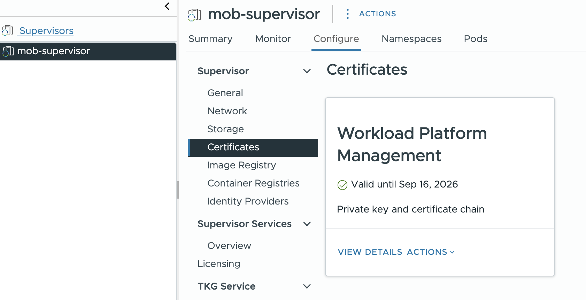

Provide the details for the certificate.

Once the CSR is generated, click `Copy`.

Sign the certificate with a CA.

From the `Workload Platform Management` pane, select `Actions > Replace Certificate`.

Upload the signed certificate file and click `Replace Certificate`.

---

## Configure Dev-ns Namespace

Create new namespace

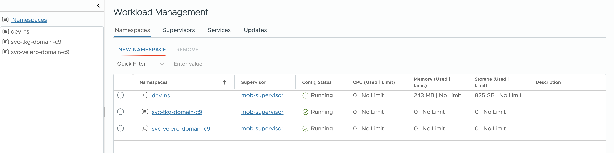

Select the `tanzu-nodes` and the network for the nodes.

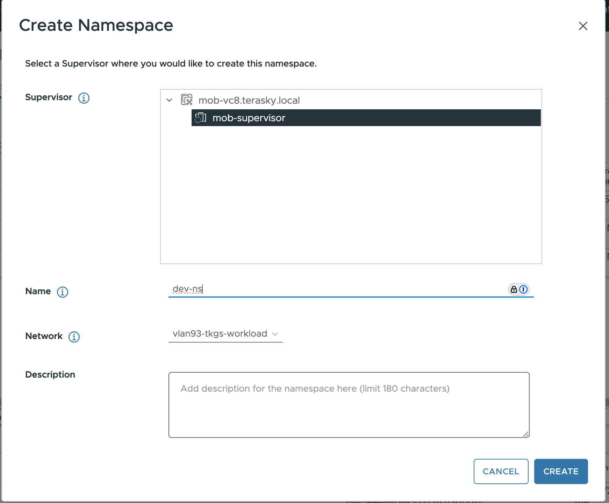

When the namespace create configure a few settings:

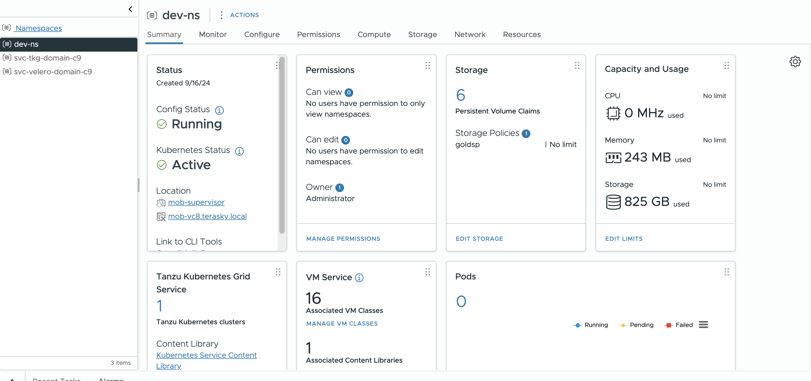

- **Permissions**: Select User or group and give a relevant permission for this namespace.
- **Storage**: Select the `tanzu-storage-policy` storage policy.
- **Tanzu Kubernetes Grid Service**: Select the `Kubernetes Service Content Library` Content Library.
- **VM Service**: Select the VM Classes that you want to enable in this namespace.

### Update Supervisor Services

The Supervisor Services in TKGs on vSphere 8U3 come with version `3.0.0-embedded`. In this version, the latest Kubernetes node image available is 1.28. If you want to deploy your Kubernetes cluster with the latest Kubernetes version 1.30, you will need to upgrade to Supervisor Services version `3.1.0`. To do this, navigate to `Workload Management` > `Service` and click on the blue link `Discover and download available Supervisor Services here.`

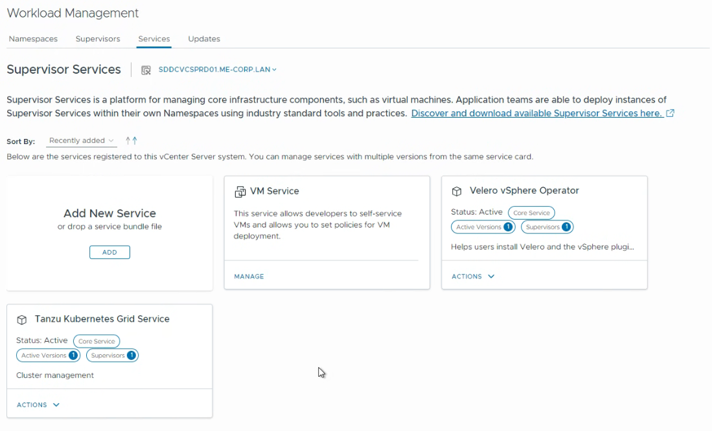
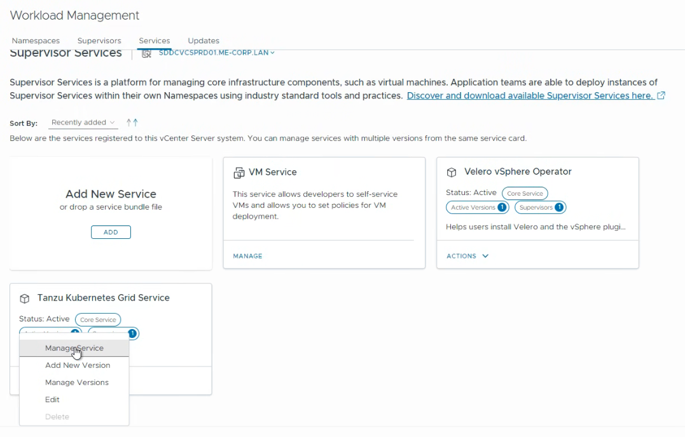
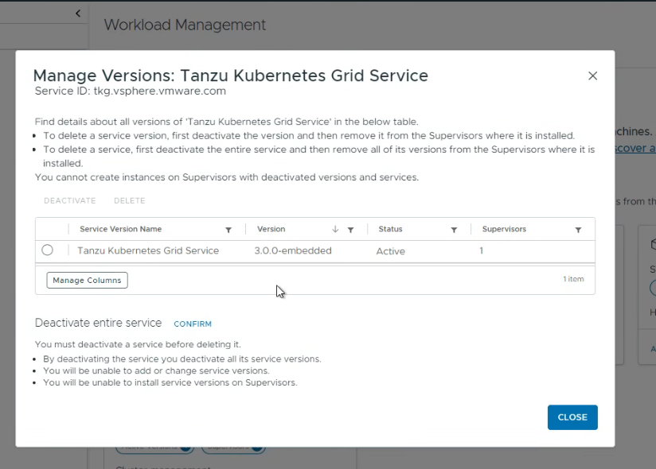
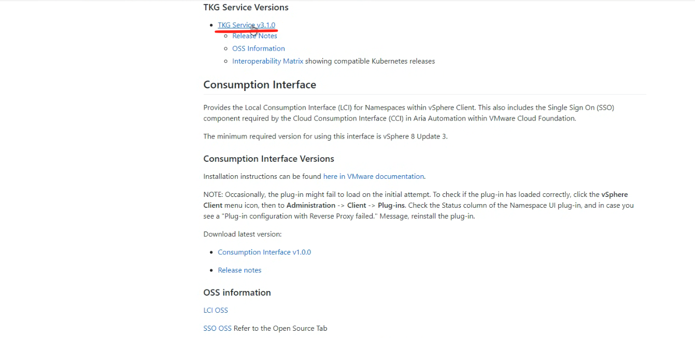
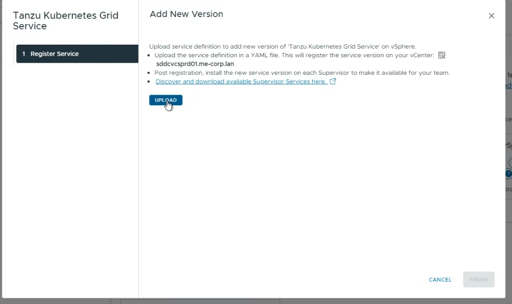
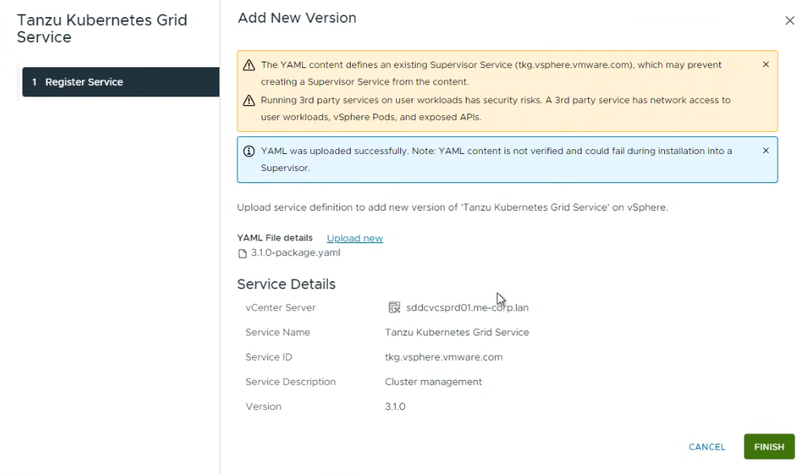
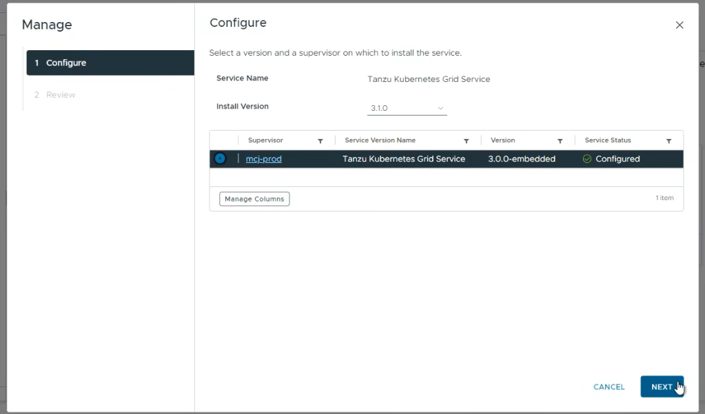
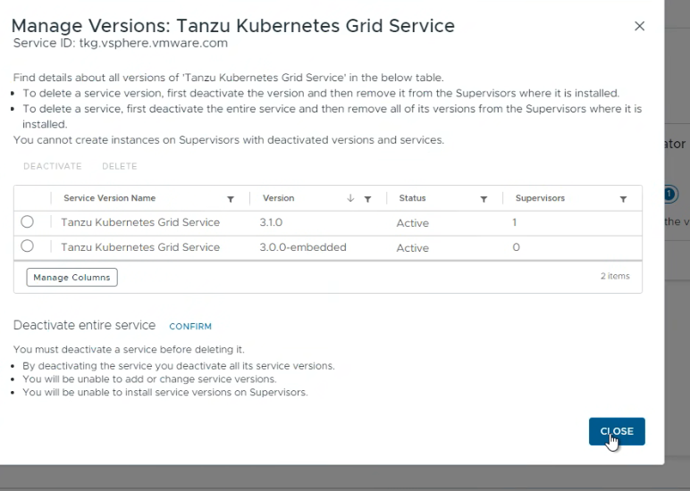

After upgrading, log in to the namespace `dev-ns` and run the command: `k get tkr`. You should now see that the version `v1.30.1---vmware.1-fips-tkg.5` is `True`, indicating that you can use this image.

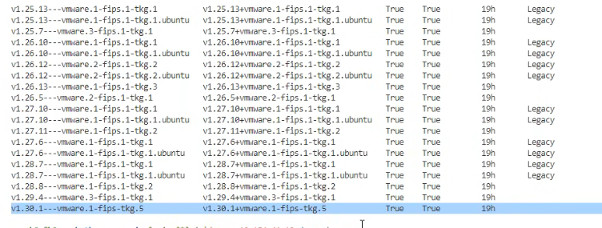

### Connecting to vSphere with Tanzu Supervisor

To connect to the supervisor, run this command in the admin VM terminal:

`k vsphere login --server=172.16.92.3 --vsphere-username=administrator@vsphere.local --insecure-skip-tls-verify`

### Configure dev-ns Namespace

[Instructions](/docs/namespaces/)

### Deploy workload Cluster

Login to the `namespace` with that command: `k vsphere login --server=172.16.92.3 --tanzu-kubernetes-cluster-namespace=dev-ns --vsphere-username=administrator@vsphere.local --insecure-skip-tls-verify`

Switch your kubectl context to the namespace.

```bash
NAMESPACE_NAME=dev-ns
kubectl config use-context "$NAMESPACE_NAME"
```

Modify the `clusters/mob-wlc-dev.yaml` manifest, ensure the information is correct and matches your environment:

- Update the value of the `additional-ca-1` in the `Secret` `mob-wlc-dev-user-trusted-ca-secret`.
  > NOTE: The content of the secret's data map is a user-defined name for the certificate ( additional-ca-1) whose value is a double base64-encoded certificate.
  >
  > Double base64-encoding is required. If the contents of the data map value are not double base6-encoded, the resulting PEM file cannot be processed.
- You can use the `kubectl get vmclassbinding` command to retrieve the available `VM Class Bindings` for the `vmClass` parameter in the manifest. The `best-effort-large` class is used for this deployment.
- You can use the `kubectl get sc` command to retrieve the storage class name for the `storageClass` parameters in the manifest. The `k8s-storage-policy-vsan` class is used for this deployment.
- You can use the `kubectl get tkr` command to retrieve the available Tanzu Kubernetes Releases.

Once you have filled out the required information, you can apply the manifest to deploy the cluster.

```bash
kubectl apply -f clusters/mob-wlc-dev.yaml
```

Connect to the cluster `k config set-context mob-wlc-dev`

#### Add a Package Repository to mob-wlc-dev Cluster

> NOTE: You can skip this step if you're managing the cluster in TMC. TMC automatically adds the repository when you attach the cluster.

Get the lates Package repository version and add the repository

```bash
PKGR_VERSION=$(imgpkg tag list -i projects.registry.vmware.com/tkg/packages/standard/repo --json | jq -r '.Tables[].Rows[-1].name')
tanzu package repository add tanzu-standard --url projects.registry.vmware.com/tkg/packages/standard/repo:$PKGR_VERSION --namespace tkg-system
```

#### Deploy cluster-autoscaler on mob-wlc-dev Cluster

[Instructions](/tkg-packages/auto-scaler/)

#### Deploy Cert-Manager on mob-wlc-dev Cluster

[Instructions](/tkg-packages/cert-manager/)

#### Deploy Contour on mob-wlc-dev Cluster

[Instructions](/tkg-packages/contour/)

#### Deploy external-dns on mob-wlc-dev Cluster

[Instructions](/tkg-packages/external-dns/)


### Configure a custom ClusterClass

[Instructions](/helpers/custom-class/)

### Configure test-ns Namespace

Repeat this section again, just change the name

[Instructions](/docs/namespaces/)

### Deploy mob-wlc-test Cluster

In this section, we will deploy the mob-wlc-test cluster and test the following:

- Configure different taints on the node pools.
- Test the auto-scaler for each node pool.
- Configure the cluster using a custom ClusterClass.

[Link to mob-wlc-test.yaml](./clusters/mob-wlc-test.yaml)

Node pool np1: Configured with the taint `taint:system`.
Node pool np2: Configured with the taint `taint:monitor`.

Now, you can deploy two test applications:

- Apply the first application with `tolerations:monitor`.
- Apply the second application with `tolerations:system`.

To test scaling, you can scale the deployments as follows:
- Scale the `application-cpu-monitor` deployment to 20 replicas:

```bash
kubectl scale deployment application-cpu-monitor --replicas=20 --namespace=app
```

You will see that only node pool np2 will scale to handle the `application-cpu-system`.
- Scale the `application-cpu-system` deployment to 20 replicas:

```bash
kubectl scale deployment application-cpu-system --replicas=20 --namespace=app
```

Now, you will see that only node pool np1 will scale to accommodate the `application-cpu-system`.

### Deploy mob-wlc-test1 Cluster

In this section, we will deploy the mob-wlc-test1 cluster and test the following:

- Configure custom machine health checks for the worker nodes.

[Link to mob-wlc-test1.yaml](./clusters/mob-wlc-test1.yaml)

#### Steps to Perform the Disk Stress Test

Retrieve the SSH password for the node:

```bash
k view-secret mob-wlc-dev-ssh-password
```

SSH into one of the nodes:

```bash
ssh vmware-system-user@<node-ip>
```
Switch to the root user and Navigate to the /etc/kubelet directory:

```bash
sudo su
cd /etc/kubelet
```

Run the disk stress test using the following command:

```bash
dd if=/dev/urandom of=sample.txt bs=1G count=22 iflag=fullblock
```
This will generate a 22 GB file named `sample.txt` to simulate disk stress.

Open two new terminal windows (split view):

- In the first terminal, run:

```bash
df -h
```

This will monitor the disk usage on the node.

- In the second terminal, run:

```bash
k describe node k describe mob-wic-test1-np1-gc26p-1cj66-c548c
```

You will see that the node status changes to `NodeHasDiskPressure`, indicating that the kubelet has identified disk pressure due to the stress test.

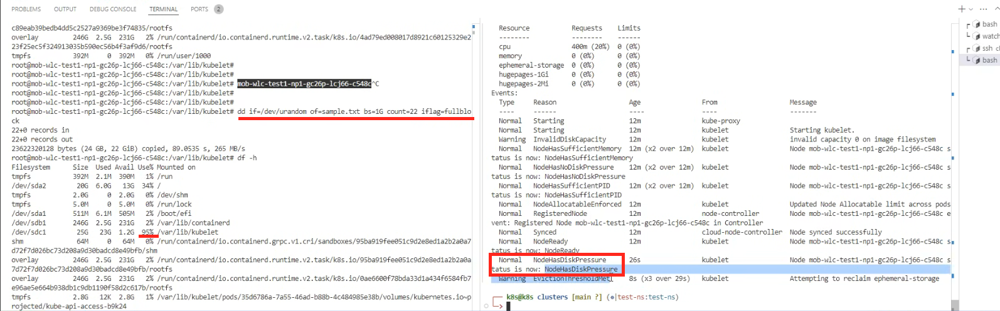