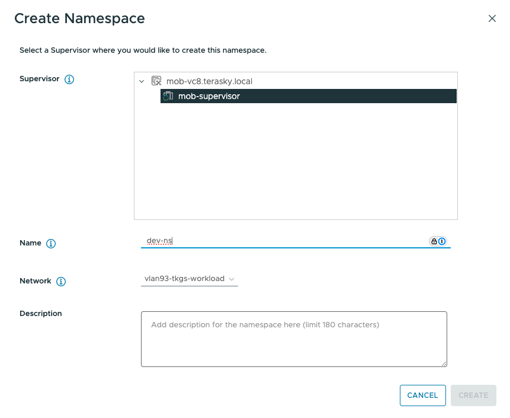
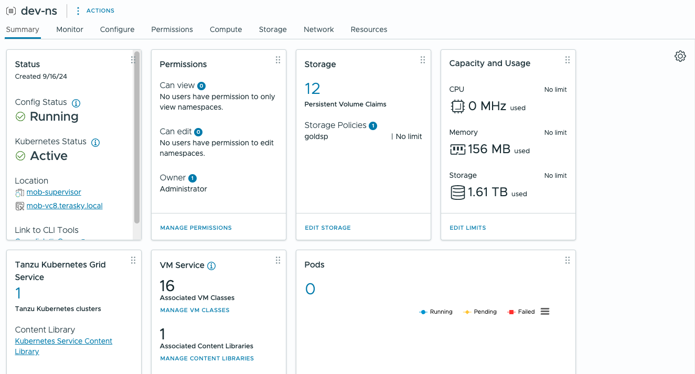
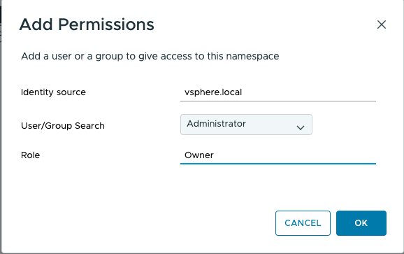
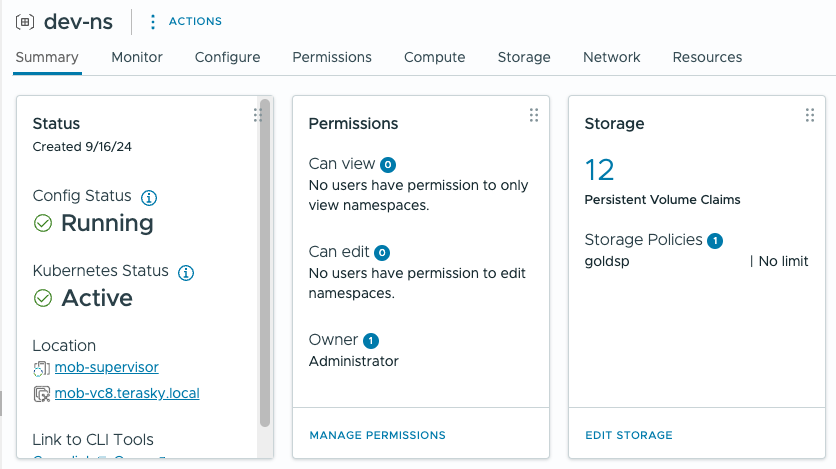
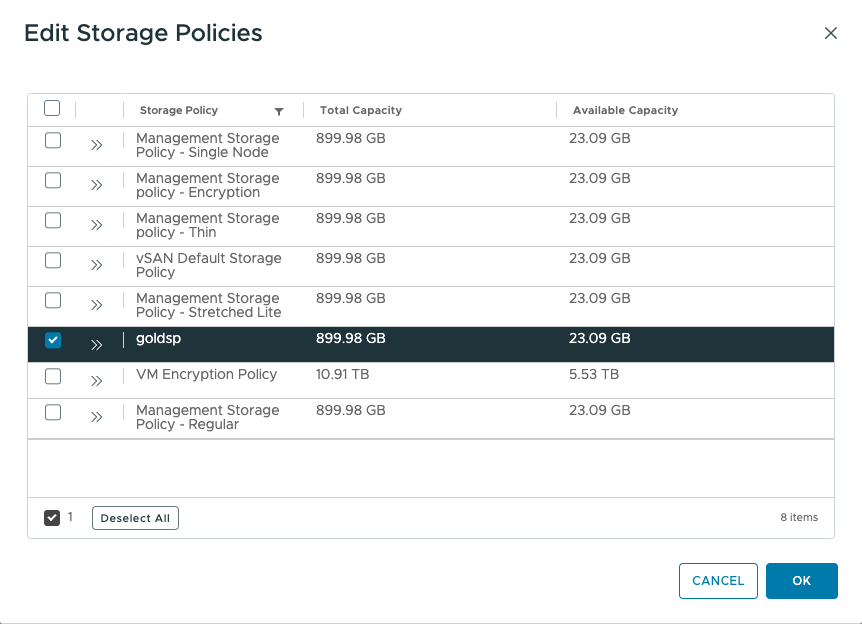
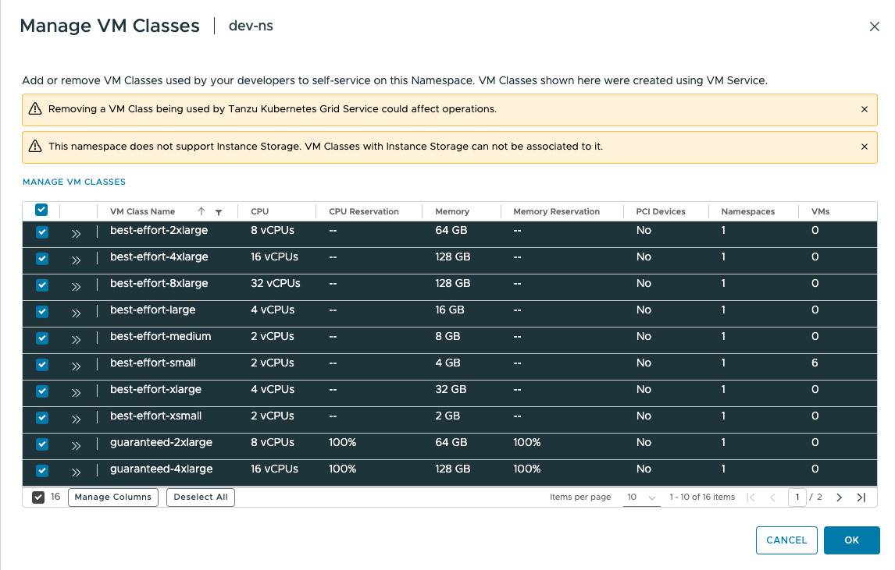

# Configure supervisor namespace

This document guides you through creating and configuring a supervisor namespace in vSphere with Tanzu. A namespace provides resource isolation and access control for your workload clusters.

## Prerequisites

- vSphere with Tanzu enabled on your vCenter Server
- Workload Management configured
- Storage policies available
- Identity source configured (Active Directory, LDAP, etc.)
- VM classes configured

## Step 1: Access the workload management interface

1. Log in to the vSphere Client
2. Navigate to **Workload Management**
3. Click the **Namespaces** tab
4. Click **New Namespace**

## Step 2: Configure namespace permissions

1. Click **Add Permissions** under the **Permissions** section
2. Select your identity source for authentication
3. Choose a user or group from the identity source
4. Select the desired permission level

**Example**: In this configuration, `tkg-admins` is used as an Active Directory user group with the **Owner** permission level.

## Step 3: Configure storage policies

1. Click **Add Storage** under the **Storage** section
2. Select your storage policy from the available options

## Step 4: Configure VM classes

1. Click **Add VM Class** under the **VM Service** section
2. Select the relevant VM classes for your workloads

## Step 5: Complete namespace creation

1. Review your configuration settings
2. Click **Create** to finalize the namespace creation

## Next steps

After creating the supervisor namespace, you can:

- Deploy workload clusters within the namespace
- Configure additional resource quotas if needed
- Set up network policies for workload isolation
- Deploy applications using the VM Service

## Related documentation

- [vSphere with Tanzu Documentation](https://docs.vmware.com/en/VMware-vSphere/8.0/vsphere-with-tanzu/GUID-index.html)
- [Workload Management Overview](https://docs.vmware.com/en/VMware-vSphere/8.0/vsphere-with-tanzu/GUID-workload-management-overview.html)
